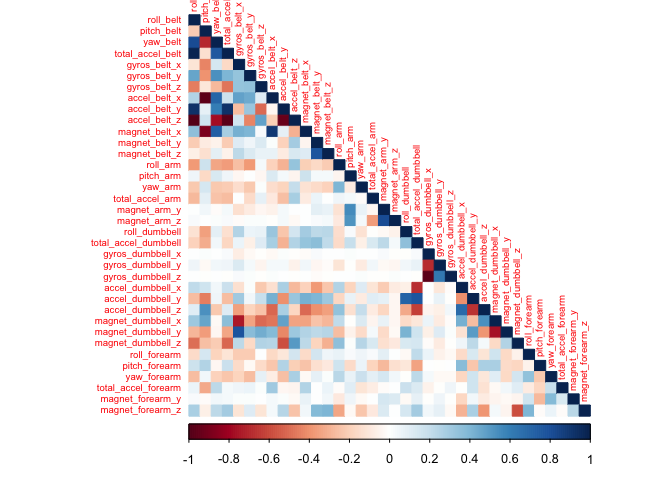
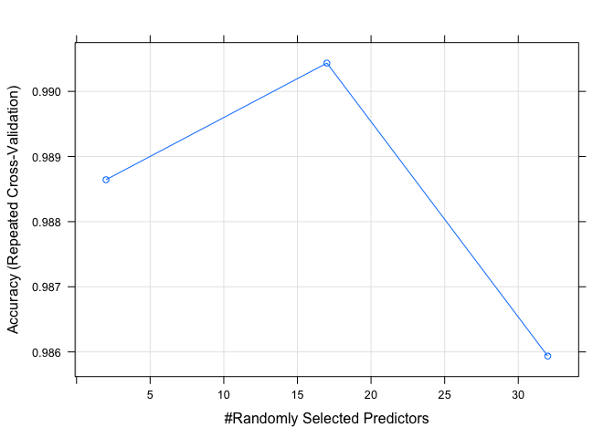

# Predicting Effective Exercise

## Summary

Utilizing on-body sensor data provided by [Groupware@LES Human Activity Recognition](http://groupware.les.inf.puc-rio.br/har), we attempt to predict how well a weight lifting activity was performed. The data consist of accelerometer measurements from sensors fitted at the waist, upper arm, wrist and the weight itself. These measurements are separated into 5 classes, one being the weight lifting activity performed in the recommended method and the others comprising common mistakes for the activity. Fitting a random forest model we were able to predict the activity class with 98.88% accuracy.

## Data Exploration

After loading the data we must determine which variables to use as predictors for the activity class (variable name = "classe"). We eliminate variables which are record information and not sensor measurements, we eliminate variables for which the majority of values are NA and finally we eliminate variables with near zero variance as these will not be valuable predictors.


```r
suppressPackageStartupMessages(library(tidyverse))
suppressPackageStartupMessages(library(caret))
suppressPackageStartupMessages(library(doParallel))
suppressPackageStartupMessages(library(corrplot))

## Set a random seed value for reproducibility
set.seed(8675309)

## Create processing core cluster for parallel operations
coreCluster <- makeCluster(detectCores() - 1)
registerDoParallel(coreCluster)

## Read in training data, treating strings "NA" and "#DIV/0!" as NA values
## to prevent being treated as character data.
pmlData <- read.csv("./pml-training.csv", na.strings = c("NA", "#DIV/0!"))

pmlData <- pmlData %>%
    # Remove record information variables
    select(-X, -user_name, -raw_timestamp_part_1, -raw_timestamp_part_2,
           -cvtd_timestamp, -new_window, -num_window) %>%
    # Remove variables with near zero variance.
    select(-nearZeroVar(pmlData))

pmlData <- pmlData %>%
    # Remove majority NA variables - using 50% as threshold.
    select(-which(colSums(is.na(pmlData) / nrow(pmlData)) > 0.5)) %>%
    # Convert classe into a factor
    mutate(classe = factor(classe))
```

The next step in defining features for our model is to evaluate which are very highly correlated and remove what we can to produce a more parsimonious model and improve compute performance on our training even though reducing the feature list may impact the prediction accuracy and increase bias.


```r
## Calculate and plot the correlation matrix
varCorrelations <- cor(pmlData %>% select(-classe))
corrplot(varCorrelations, method = "color", type = "lower", tl.cex = 0.6)
```

<!-- -->

```r
## Determine which variable pairs are the most highly correlated (a
## cutoff of 0.95 is used) and eliminate the one having the highest mean
## correlation
highlyCorrelated <- findCorrelation(varCorrelations, cutoff = 0.95, 
                                    verbose = TRUE)
```

```
## Compare row 10  and column  1 with corr  0.992 
##   Means:  0.289 vs 0.181 so flagging column 10 
## Compare row 1  and column  4 with corr  0.981 
##   Means:  0.261 vs 0.175 so flagging column 1 
## Compare row 2  and column  8 with corr  0.966 
##   Means:  0.254 vs 0.17 so flagging column 2 
## Compare row 22  and column  24 with corr  0.979 
##   Means:  0.074 vs 0.17 so flagging column 24
```

```r
pmlData <- pmlData %>% select(-all_of(highlyCorrelated))
```

With our features chosen, the data must be separated into Training and Testing partitions in order to evaluate our prediction accuracy. We retain 30% of the data for testing and the remainder for training our model.


```r
inTraining <- createDataPartition(pmlData$classe, p = 0.7, list = FALSE)
pmlTraining <- pmlData[inTraining, ]
pmlTesting <- pmlData[-inTraining, ]
```

## Fitting a Model

A cross-validation control is created for training , repeated k-fold cross validation is used.


```r
cvControl <- trainControl(method="repeatedcv", repeats = 5, 
                          allowParallel = TRUE)
```

A random forest model will be used for prediction on this data set because it often produces a highly accurate model although at the expense of interpretability and computational complexity.


```r
rfModel <- train(classe ~ ., data = pmlTraining, method = "rf",
                 trControl = cvControl)

rfModel$finalModel
```

```
## 
## Call:
##  randomForest(x = x, y = y, mtry = param$mtry) 
##                Type of random forest: classification
##                      Number of trees: 500
## No. of variables tried at each split: 17
## 
##         OOB estimate of  error rate: 0.87%
## Confusion matrix:
##      A    B    C    D    E class.error
## A 3901    3    1    0    1 0.001280082
## B   18 2627   11    0    2 0.011662904
## C    0   26 2352   18    0 0.018363940
## D    2    1   26 2220    3 0.014209591
## E    0    0    2    6 2517 0.003168317
```

```r
plot(rfModel)
```

<!-- -->

```r
confusionMatrix(predict(rfModel, newdata = pmlTesting), pmlTesting$classe)
```

```
## Confusion Matrix and Statistics
## 
##           Reference
## Prediction    A    B    C    D    E
##          A 1669    8    0    0    0
##          B    2 1115   11    0    0
##          C    1   15 1008   10    3
##          D    0    0    7  952    4
##          E    2    1    0    2 1075
## 
## Overall Statistics
##                                           
##                Accuracy : 0.9888          
##                  95% CI : (0.9858, 0.9913)
##     No Information Rate : 0.2845          
##     P-Value [Acc > NIR] : < 2.2e-16       
##                                           
##                   Kappa : 0.9858          
##                                           
##  Mcnemar's Test P-Value : NA              
## 
## Statistics by Class:
## 
##                      Class: A Class: B Class: C Class: D Class: E
## Sensitivity            0.9970   0.9789   0.9825   0.9876   0.9935
## Specificity            0.9981   0.9973   0.9940   0.9978   0.9990
## Pos Pred Value         0.9952   0.9885   0.9720   0.9886   0.9954
## Neg Pred Value         0.9988   0.9950   0.9963   0.9976   0.9985
## Prevalence             0.2845   0.1935   0.1743   0.1638   0.1839
## Detection Rate         0.2836   0.1895   0.1713   0.1618   0.1827
## Detection Prevalence   0.2850   0.1917   0.1762   0.1636   0.1835
## Balanced Accuracy      0.9976   0.9881   0.9882   0.9927   0.9962
```

The resulting accuracy of 98.88% and lower bound confidence interval of 98.58% indicate we can be highly confident that our random forest model can predict the quality of performance in the weight lifting activity.
